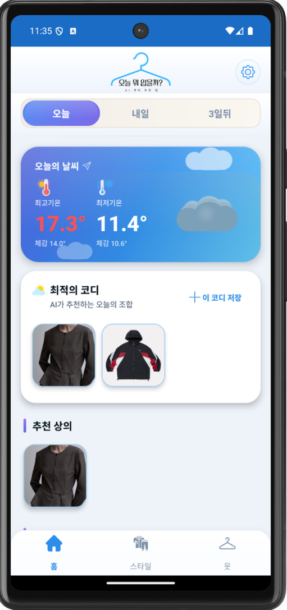
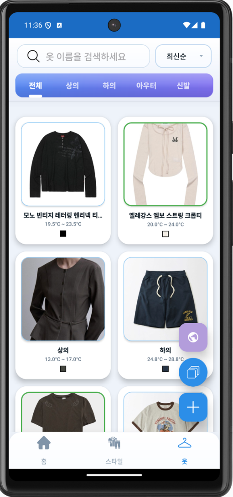
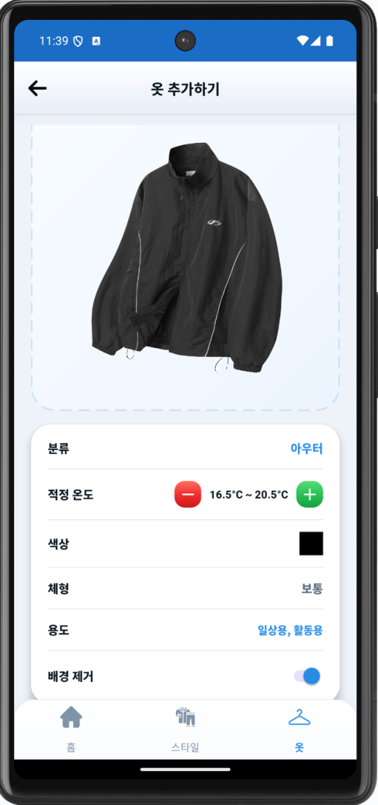
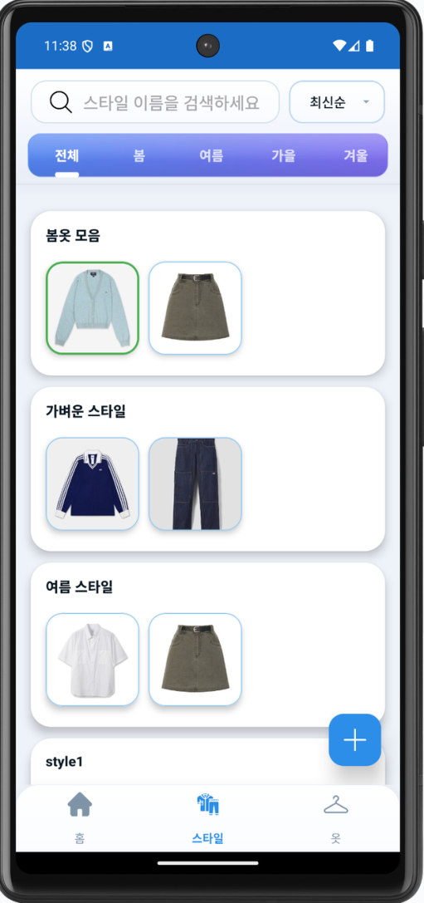
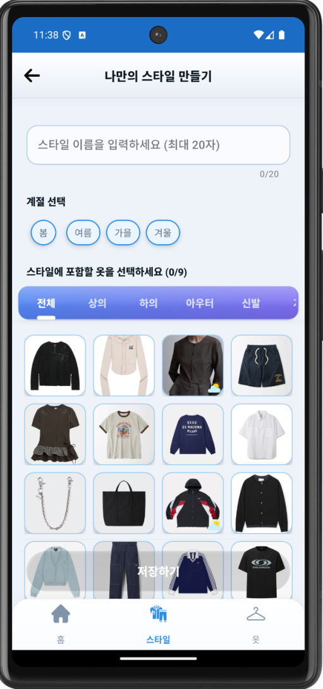
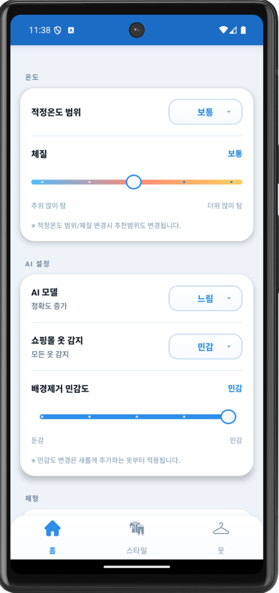
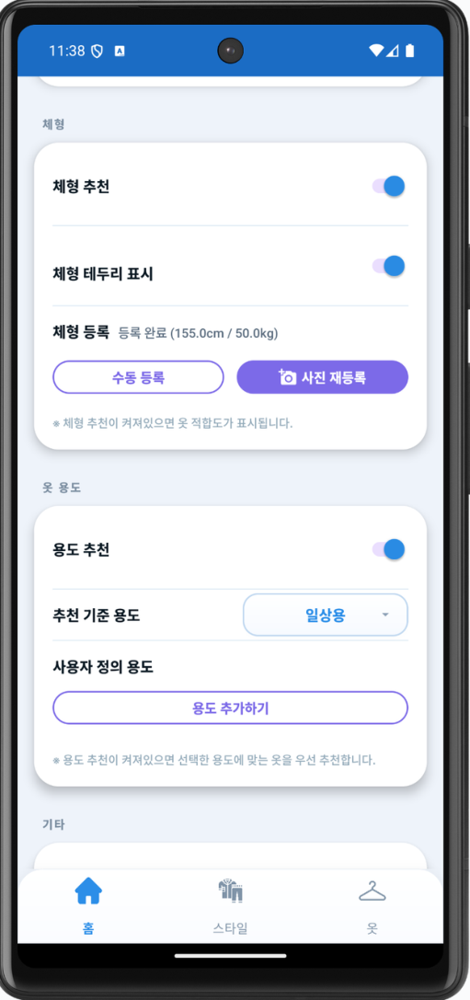
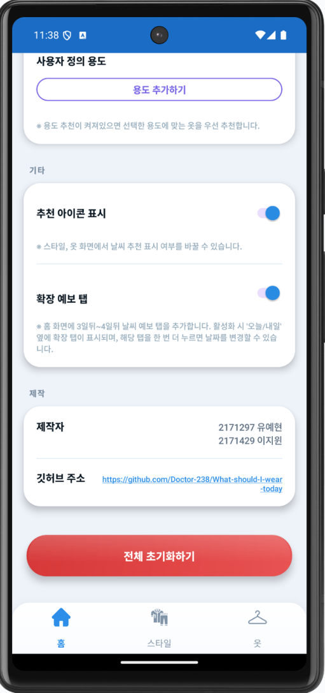
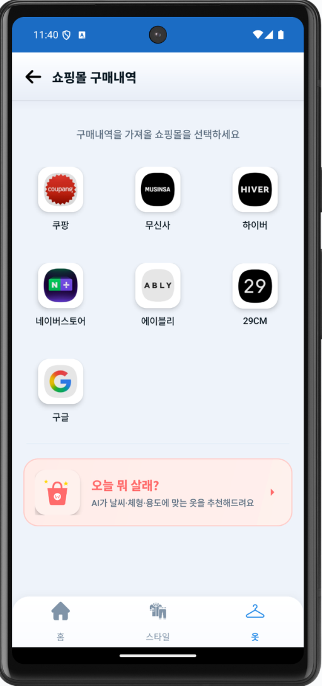
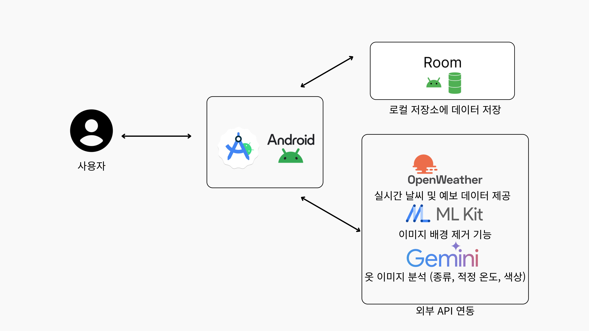

# 👕 오늘 뭐 입지?

> 내 옷장을 등록해두면 AI가 날씨에 맞는 코디를 매일 추천해주는 Android 앱

옷이 많은데 뭘 입을지 모르겠거나, 날씨를 보고 옷을 고르는 게 귀찮을 때 사용하는 앱입니다.  
옷 사진을 올리면 Gemini AI가 카테고리·온도·색상을 자동으로 분석해 옷장을 만들어주고,  
오늘 날씨에 맞는 최적의 코디 조합을 추천해줍니다.


-blue)


---

## 📱 화면 구성

<table>
  <tr>
    <td align="center"><br><sub><b>홈 · AI 코디 추천</b></sub></td>
    <td align="center"><br><sub><b>옷장 목록</b></sub></td>
    <td align="center"><br><sub><b>옷 추가 · AI 분석</b></sub></td>
    <td align="center"><br><sub><b>스타일 목록</b></sub></td>
    <td align="center"><br><sub><b>나만의 스타일</b></sub></td>
  </tr>
  <tr>
    <td align="center"><br><sub><b>설정</b></sub></td>
    <td align="center"><br><sub><b>체형 · 온도 설정</b></sub></td>
    <td align="center"><br><sub><b>사용자 정보</b></sub></td>
    <td align="center"><br><sub><b>쇼핑몰 선택</b></sub></td>
    <td align="center"><br><sub><b>오늘 뭐 살래?</b></sub></td>
  </tr>
</table>

---

## 🎬 데모

> 썸네일을 클릭하면 YouTube에서 재생됩니다

[](https://youtu.be/BSDagR65s2g?autoplay=1)

---

## 🛠 주요 기능

### 🏠 홈 — AI 코디 추천

앱을 실행하면 현재 위치를 자동으로 가져와 OpenWeatherMap에서 날씨 데이터를 조회하고,  
Gemini AI가 내 옷장 전체를 분석해 그날 날씨에 맞는 코디를 구성합니다.

- **날짜 탭** — 오늘 / 내일 / 3일 뒤 탭 전환으로 날짜별 코디 미리 확인  
  (설정에서 확장 예보를 켜면 최대 5일 뒤까지 확인 가능)
- **최적 코디** — AI가 그날 날씨에 가장 잘 맞는 상의·하의·아우터 1개 조합을 선정
- **카테고리별 추천** — 최적 코디 외에도 추천 상의·하의·아우터 목록을 별도 제공
- **일교차 알림** — 하루 최고·최저 기온 차가 12°C 이상이면 챙겨갈 아우터를 별도 추천 (특별 아이콘으로 구분)
- **우산 알림** — 강수확률 40% 이상이면 "우산을 챙기세요", 70% 이상이면 강화 알림 배너 표시
- **체질·온도 반영** — 설정한 체질(추위/더위 민감도)과 온도 범위(좁게/보통/넓게)가 추천 로직에 직접 적용
- **착용 목적 반영** — 격식 / 일상 / 활동 / 데이트 / 집앞 등 오늘의 목적을 설정하면 상황에 맞게 추천

---

### 👔 옷장 — 스마트 의류 관리

#### AI 이미지 분석
옷 사진을 올리면 Gemini AI가 아래 항목을 자동으로 인식합니다.

| 분석 항목 | 내용 |
|---|---|
| 카테고리 | 상의 / 하의 / 아우터 / 진발 / 기타 자동 분류 |
| 적정 온도 | 해당 옷이 적합한 온도 범위 (예: 10°C ~ 20°C) |
| 색상 | 주요 색상 HEX 코드 추출 |

분석값은 저장 전에 수동으로 수정할 수 있습니다.

#### 배경 제거
ML Kit Selfie Segmentation으로 옷 사진의 배경을 자동 제거합니다.  
배경과 옷의 경계가 모호한 경우를 위해 **민감도를 1~5단계**로 조절할 수 있습니다.

#### 일괄 추가
여러 옷 사진을 한 번에 선택하면 WorkManager가 백그라운드에서 순차 처리합니다.  
진행 상황은 알림으로 확인할 수 있으며, 앱을 종료해도 작업이 중단되지 않습니다.

#### 목록 관리
- 카테고리 탭: 전체 / 상의 / 하의 / 아우터 / 진발
- 이름 검색 및 최신순 정렬
- 개별 옷 정보 수정 및 삭제

---

### 👗 스타일 — 코디 저장·관리

- **홈에서 바로 저장** — AI가 추천한 코디를 버튼 한 번으로 스타일에 저장
- **직접 조합** — 옷장에서 원하는 옷을 골라 나만의 스타일 생성
- **계절별 분류** — 봄 / 여름 / 가을 / 겨울로 구분해 저장
- **자동 정리** — 스타일에 포함된 옷을 삭제하면 해당 스타일도 함께 정리되어 빈 스타일이 남지 않음
- 스타일 이름 설정, 편집, 삭제 지원

---

### 🛍 쇼핑 연동

#### 외부 쇼핑몰 바로가기
오늘 AI가 추천한 코디 키워드를 바탕으로 원하는 쇼핑 플랫폼을 골라 검색할 수 있습니다.

| 지원 플랫폼 |
|---|
| 무신사 / 하이버 / 에이블리 / 29CM / 네이버스토어 / 구구 / 구글 쇼핑 |

#### 오늘 뭐 살래? (앱 내 쇼핑몰)
앱 내 자체 상품 목록을 카테고리(상의·하의·아우터·신발·기타)와 검색으로 탐색하고,  
AI 맞춤 추천 버튼으로 현재 날씨·체형 정보를 반영한 상품을 추천받을 수 있습니다.  
마음에 드는 상품은 하트 버튼으로 위시리스트에 저장합니다.

---

### ⚙️ 맞춤 설정

앱의 모든 추천 로직이 아래 설정값을 반영합니다.

#### 체질 · 온도

| 설정 | 옵션 | 효과 |
|---|---|---|
| 체질 | 5단계 (추위 많이 탐 → 더위 많이 탐) | 기온 기준 ±3°C까지 보정 |
| 온도 범위 | 좁게 / 보통 / 넓게 | 옷별 적정 온도 허용 범위 조절 |

#### 체형 · 사이즈

| 설정 | 내용 |
|---|---|
| 체형 정보 | 키·몸무게·허리 등록 → 추천 코디에 사이즈 아이콘 표시 |
| 사이즈 표기 | 영문 (XS/S/M/L/XL) 또는 숫자 (상의 85~110, 하의 26~34) 선택 |

#### AI · 기타

| 설정 | 옵션 |
|---|---|
| AI 모델 | 빠름 (Gemini 2.5 Flash Lite) / 정확 (Gemini 2.5 Flash) |
| 착용 목적 | 격식 / 일상 / 활동 / 데이트 / 집앞 + 커스텀 목적 직접 추가 |
| 배경 제거 민감도 | 1~5단계 |
| 확장 예보 | on 시 3일 뒤 이후 날짜까지 코디 확인 가능 |
| 추천 아이콘 표시 | 옷장 목록에서 오늘 추천된 옷 아이콘 on/off |
| 전체 초기화 | 모든 설정을 기본값으로 리셋 |

---

### 📌 홈 위젯

앱을 열지 않고도 홈 화면에서 오늘의 추천 코디를 바로 확인할 수 있는 위젯을 지원합니다.  
WidgetUpdateWorker가 백그라운드에서 위젯을 자동으로 갱신합니다.

---

## 🏗 기술 구조



**패턴:** MVVM + Repository + Single Activity

```
UI Layer         Fragment + XML ViewBinding (Navigation Component)
      │
      │  LiveData 관찰 / Event 단발성 소비
      ▼
ViewModel        HomeViewModel / ClosetViewModel / StyleViewModel
Layer            MallMainViewModel / SettingsViewModel ...
      │
      │  suspend 함수 / Kotlin Coroutines
      ▼
Repository       ClothingRepository ── Room DB  (ClothingItem, v13)
Layer            StyleRepository    ── Room DB  (SavedStyle + CrossRef)
                 WeatherRepository  ── OpenWeatherMap API (Retrofit2)
                 MallRepository     ── Room DB  (MallItem)
      │
      │  직접 호출
      ▼
External         Google Gemini API   옷 이미지 분석 + 코디 추천
Services         ML Kit              옷 사진 배경 제거
                 OpenWeatherMap      현재 날씨 + 5일 예보
                 Google Location     현재 위치 좌표
```

- **Navigation:** `MainActivity` 단일 Activity + Navigation Component, 하단 탭 4개
- **비동기:** `viewModelScope.launch` / Kotlin Coroutines 전체 적용
- **이미지 로딩:** Glide 4.16 + `MyAppGlideModule`
- **백그라운드:** WorkManager (`BatchAddWorker`, `MallBatchAddWorker`, `WidgetUpdateWorker`)
- **이벤트 래퍼:** `Event<T>` — 단발성 LiveData 소비 (토스트·네비게이션 중복 방지)

---

## 📂 프로젝트 구조

```
app/src/main/java/.../whatshouldiweartoday/
├── ai/
│   └── AiModelProvider.kt          # Gemini 모델 초기화 (Flash / Flash Lite 선택)
├── data/
│   ├── api/
│   │   ├── WeatherApiService.kt    # OpenWeatherMap Retrofit 인터페이스
│   │   └── WeatherResponse.kt      # 날씨 응답 모델
│   ├── database/
│   │   ├── AppDatabase.kt          # Room DB (v13)
│   │   ├── ClothingItem.kt         # 옷 Entity (카테고리·온도·색상·이미지 URI)
│   │   ├── ClothingDao.kt
│   │   ├── SavedStyle.kt           # 스타일 Entity (계절 포함)
│   │   ├── StyleItemCrossRef.kt    # 스타일 ↔ 옷 M:N 연결 테이블
│   │   ├── Migrations.kt           # Room 마이그레이션
│   │   └── mall/
│   │       ├── MallDatabase.kt
│   │       ├── MallItem.kt         # 쇼핑몰 상품 Entity
│   │       └── MallDao.kt
│   ├── preference/
│   │   └── SettingsManager.kt      # SharedPreferences 래퍼 (모든 설정값)
│   └── repository/
│       ├── ClothingRepository.kt
│       ├── StyleRepository.kt
│       ├── WeatherRepository.kt
│       └── MallRepository.kt
├── ui/
│   ├── home/
│   │   ├── HomeFragment.kt         # 날씨 조회 + 코디 추천 메인 화면
│   │   ├── HomeViewModel.kt        # 추천 로직 + 날씨 데이터 처리
│   │   ├── RecommendationFragment.kt
│   │   └── WeatherAnimView.kt      # 날씨 상태 커스텀 뷰
│   ├── closet/
│   │   ├── ClosetFragment.kt       # 옷장 목록 (카테고리 탭)
│   │   ├── AddClothingFragment.kt  # 옷 추가 + AI 분석
│   │   ├── EditClothingFragment.kt
│   │   └── BatchAddWorker.kt       # WorkManager: 일괄 추가 백그라운드 처리
│   ├── style/
│   │   ├── StyleFragment.kt        # 스타일 목록 (계절 탭)
│   │   ├── SaveStyleFragment.kt    # 스타일 저장
│   │   └── EditStyleFragment.kt
│   ├── mall/
│   │   ├── MallMainFragment.kt     # 내부 쇼핑몰 목록
│   │   ├── MallItemDetailFragment.kt
│   │   ├── MallRecommendationFragment.kt
│   │   ├── CartFragment.kt
│   │   ├── WishlistFragment.kt
│   │   └── MallBatchAddWorker.kt
│   ├── settings/
│   │   └── SettingsFragment.kt
│   └── custom/
│       ├── CropOverlayView.kt      # 이미지 크롭 커스텀 뷰
│       └── ProgressFab.kt          # 진행률 표시 FAB
├── util/
│   ├── Event.kt                    # 단발성 LiveData 이벤트 래퍼
│   └── NetworkUtils.kt
├── TodayRecoWidgetProvider.kt      # 홈 위젯
├── WidgetUpdateWorker.kt
└── MainActivity.kt
```

---

## 🚀 시작하기

### 1. 저장소 클론

```bash
git clone https://github.com/Doctor-238/What-should-I-wear-today.git
cd What-should-I-wear-today
```

### 2. API 키 설정

프로젝트 루트에 `local.properties` 파일을 열어 아래 두 키를 추가합니다.

```properties
WEATHER_API_KEY=your_openweathermap_api_key
GEMINI_API_KEY=your_gemini_api_key
```

- **OpenWeatherMap API 키** — [openweathermap.org](https://openweathermap.org/api) 에서 무료 발급
- **Gemini API 키** — [Google AI Studio](https://aistudio.google.com/) 에서 무료 발급

> `local.properties`는 `.gitignore`에 등록되어 있어 저장소에 올라가지 않습니다.  
> API 키 없이 실행하면 AI 분석·날씨 조회가 동작하지 않습니다.

### 3. 빌드 및 실행

```bash
./gradlew assembleDebug          # 디버그 APK 빌드
./gradlew assembleRelease        # 릴리즈 APK 빌드
./gradlew testDebugUnitTest      # 유닛 테스트
./gradlew connectedAndroidTest   # 기기 연결 후 통합 테스트
./gradlew lint                   # 린트 검사
./gradlew clean                  # 빌드 캐시 정리
```

Android Studio에서는 `app` 모듈을 선택하고 **Run** 버튼으로 바로 실행할 수 있습니다.

---

## ⚙️ 개발 환경

| 항목 | 내용 |
|---|---|
| 언어 | Kotlin |
| IDE | Android Studio |
| Min SDK | 26 (Android 8.0) |
| Target / Compile SDK | 34 |
| 빌드 시스템 | Gradle Kotlin DSL |
| UI | XML View System + ViewBinding |
| 비동기 | Kotlin Coroutines + viewModelScope |
| 로컬 DB | Room 2.6 (SQLite, v13) |
| 네트워크 | Retrofit2 + OkHttp + kotlinx.serialization |
| AI | Google Gemini 2.5 Flash / Flash Lite |
| 이미지 처리 | ML Kit Selfie Segmentation, Glide 4.16 |
| 백그라운드 | WorkManager 2.9 |
| 위치 | Google Play Services Location 21.3 |
| 스플래시 | AndroidX Core SplashScreen |

---

## 🧑‍💻 팀

| 이름 | GitHub | 역할 |
|---|---|---|
| 유예현 | [Doctor-238](https://github.com/Doctor-238/) | 기획 · 기능 설계 · Android 개발 · API 연동 |
| 이지원 | [CH4ER1](https://github.com/CH4ER1) | UI/UX 디자인 · 문서 작성 |
